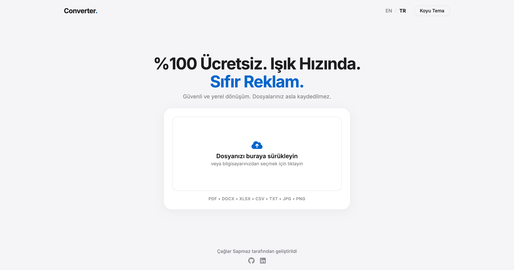

# 🔄 Convrt

Farklı dosya formatları arasında (PDF, DOCX, XLSX, görsel vb.) dönüştürme işlemleri yapan, FastAPI tabanlı ücretsiz bir dosya dönüştürme servisi.

<p align="left">
  
  
  
</p>


---

## 🖼️ Ekran Görüntüsü

<picture>
  <source media="(prefers-color-scheme: dark)" srcset="./assets/screenshot-dark.png">
  <source media="(prefers-color-scheme: light)" srcset="./assets/screenshot-light.png">
  
</picture>

## 📖 Proje Hakkında

**Convrt**, kullanıcıların dosyalarını farklı formatlara kolayca ve ücretsiz dönüştürmesine olanak tanıyan hafif bir web servisidir. Tamamen reklamsız çalışır; dosyalarınız hiçbir zaman sunucuda saklanmaz.

Backend tarafı **FastAPI** ile geliştirilmiş olup **Render** üzerinde çalışmaktadır.

## ✨ Özellikler

- 📄 PDF ↔ DOCX dönüşümü
- 🖼️ Görsel işleme ve dönüştürme (JPG, PNG ve diğerleri)
- 📊 Excel (XLSX) ve CSV dosyaları ile çalışma
- 🌐 HTML ↔ PDF dönüşümü
- 📝 TXT formatı desteği
- 🔒 Gizlilik odaklı — dosyalarınız asla depolanmaz
- 🚫 Sıfır reklam
- 🌍 Türkçe / İngilizce dil desteği
- 🌙 Açık / Koyu tema desteği
- ⚡ Hızlı ve hafif REST API

## 🗂️ Proje Yapısı

```
convrt/
├── api/                # FastAPI giriş noktası
├── converters/         # Dönüştürme mantığının bulunduğu modüller
├── public/             # Statik/istemci tarafı dosyalar
├── requirements.txt    # Python bağımlılıkları
└── vercel.json         # (Artık kullanılmıyor)
```

## 🛠️ Kullanılan Teknolojiler

| Kütüphane | Kullanım Amacı |
|---|---|
| `fastapi` | API sunucusu |
| `uvicorn` | ASGI sunucusu |
| `python-multipart` | Dosya yükleme desteği |
| `Pillow` | Görsel işleme |
| `PyMuPDF` | PDF işleme |
| `python-docx` | Word (.docx) dosyaları oluşturma/düzenleme |
| `openpyxl` | Excel (.xlsx) dosyaları ile çalışma |
| `pdf2docx` | PDF → DOCX dönüşümü |
| `mammoth` | DOCX → HTML dönüşümü |
| `xhtml2pdf` | HTML → PDF dönüşümü |

## 🚀 Kurulum

```bash
# Depoyu klonlayın
git clone https://github.com/caglarsapmaz/convrt.git
cd convrt

# Sanal ortam oluşturun (opsiyonel ama önerilir)
python -m venv venv
source venv/bin/activate  # Windows: venv\Scripts\activate

# Bağımlılıkları yükleyin
pip install -r requirements.txt
```

## ▶️ Çalıştırma

```bash
uvicorn api.index:app --reload
```

Sunucu ayağa kalktıktan sonra API varsayılan olarak `http://127.0.0.1:8000` adresinde çalışır.

## ☁️ Render ile Dağıtım

Proje, **Render** üzerinde web servisi olarak çalışmaktadır:

1. [render.com](https://render.com) üzerinde yeni bir **Web Service** oluşturun.
2. Bu repoyu bağlayın.
3. Build komutu olarak `pip install -r requirements.txt` girin.
4. Start komutu olarak `uvicorn api.index:app --host 0.0.0.0 --port $PORT` girin.
5. Deploy edin.

## 🤝 Katkıda Bulunma

Katkılarınızı bekliyoruz! Lütfen bir issue açın veya pull request gönderin.

1. Bu depoyu fork'layın
2. Yeni bir branch oluşturun (`git checkout -b ozellik/yeni-ozellik`)
3. Değişikliklerinizi commit'leyin (`git commit -m 'Yeni özellik eklendi'`)
4. Branch'inizi push'layın (`git push origin ozellik/yeni-ozellik`)
5. Bir Pull Request açın

## 📄 Lisans

Bu proje [MIT Lisansı](LICENSE) ile lisanslanmıştır — dilediğiniz gibi kullanabilir, değiştirebilir ve dağıtabilirsiniz.

---

<p align="center">Made with ❤️ by <a href="https://github.com/caglarsapmaz">caglarsapmaz</a></p>
